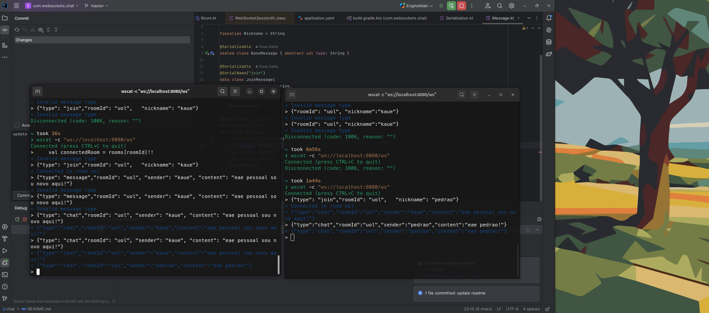

# Bate papo uol (like)
No momento que o usuário entra em uma sala, começa a ouvir mensagens da sala. Usuário precisa estar na sala para enviar mensagens dela.

# Messages:
## Join:
`{"type": "join","roomId": "uol", "nickname": "kaue"}`
## Message:
`{"type": "chat","roomId": "uol", "sender": "kaue", "content": "eae pessoal sou novo aqui!"}`

